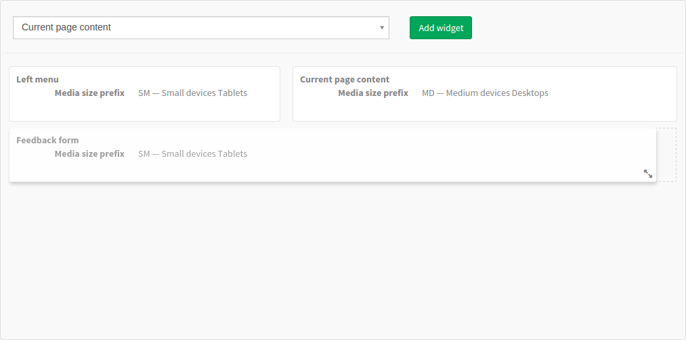
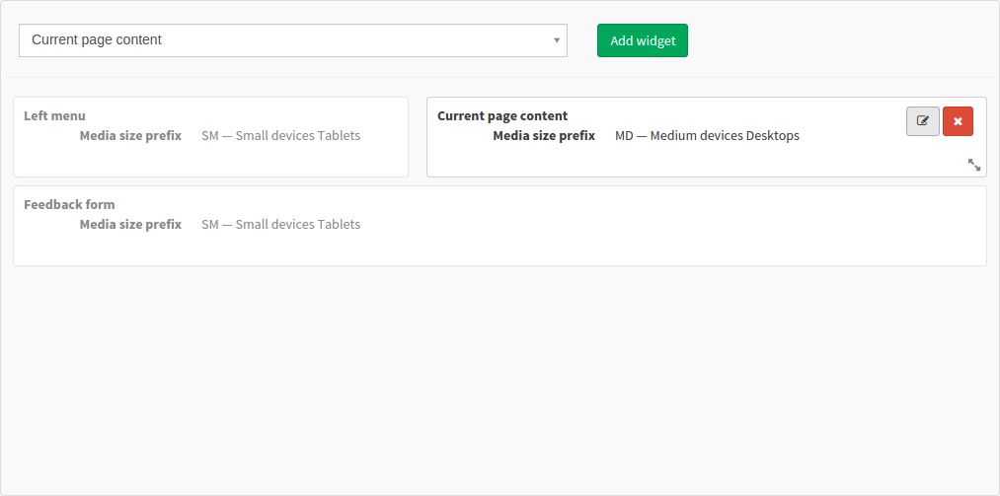
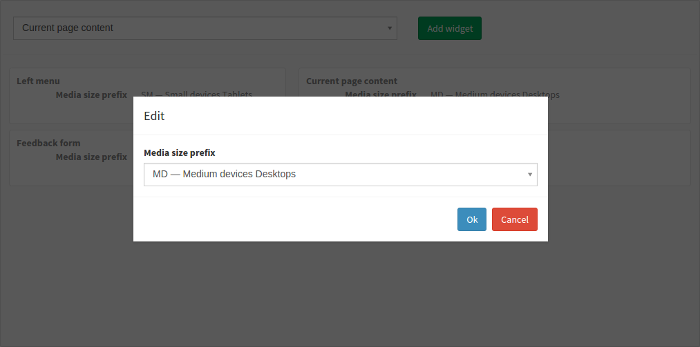

# PageLayoutBundle
Bootstrap page layout for Symfony [Sonata Admin Bundle](https://github.com/sonata-project/SonataAdminBundle),
based on [gridstack.js](https://github.com/troolee/gridstack.js)

## Preview
### Simple editor in Sonata Admin




### Bootstrap grid as result


## Installation
### With Composer
``` bash
composer require it-blaster/page-layout-bundle
```

### Run `bower install` in bundle's directory
``` bash
cd vendor/it-blaster/page-layout-bundle/Etfostra/PageLayoutBundle && bower install
```

### Register the bundle in your `AppKernel.php`
``` php
...
new Etfostra\PageLayoutBundle\EtfostraPageLayoutBundle(),
...
```

### Edit `config.yml`
Add `EtfostraPageLayoutBundle` to `assetic.bundles`
``` yaml
assetic:
    ...
    bundles:
        ...
        - EtfostraPageLayoutBundle
```

## Configuration
All configs are optional, default values present below, `config.yml`: 
``` yaml
etfostra_page_layout:
    grid_settings: # https://github.com/troolee/gridstack.js#options
        always_show_resize_handle: false
        animate: true
        auto: true
        cell_height: 80
        draggable:
            handle: '.grid-stack-item-content'
            scroll: true
            appendTo: 'body'
        handle: '.grid-stack-item-content'
        handle_class: ''
        height: 0
        float: false # http://troolee.github.io/gridstack.js/demo/float.html
        item_class: 'grid-stack-item'
        min_width: 768
        placeholder_class: 'grid-stack-placeholder'
        placeholder_text: ''
        resizable:
            autoHide: true
            handles: 'se'
        static_grid: false
        vertical_margin: 10
        width: 12
        item_min_width: 4
    properties: # data for generating additional widget properties (options in select)
        media_size_prefix:
            xs: XS — Extra small devices
            sm: SM — Small devices Tablets
            md: MD — Medium devices Desktops
            lg: LG — Large devices Desktops
    templates:
        front_layout: EtfostraPageLayoutBundle:Frontend:page_layout.html.twig
```

## Using
### Insert `page_layout` field in Sonata Admin class
``` php
class YourAdmin extends Admin
{
    ...
    protected function configureFormFields(FormMapper $formMapper)
    {
        ...
        $formMapper
            ->add('your_text_field', 'page_layout', array(
                'required' => false,
                'choices'  => array(
                    // Key and value can be any string, it's up to you.
                    // This keys will be available later in WidgetRenderer::setWidgets
                    'CurrentPage:'          => 'Current page content',
                    'Widget:feedbackform'   => 'Feedback form',
                    'Widget:leftmenu'       => 'Left menu',
                ),
            ))
        ...
    }
```

From now, you can edit and save (to `your_text_field`) data of grid in Sonata Admin.

### Frontend layout generation
For layout generation we must call and configure `etfostra_page_layout.services.page_layout` service form controller
``` php
$layout = $this->get('etfostra_page_layout.services.page_layout')
    ->setLayoutData( $your_text_field )
    ->setWidgetRenderer( $renderer )
    ->render();
```

But now we have two undefined variables! It's ok, how to define it:
``` php
$your_text_field = $yourObject->getYourTextField(); // It's simple, this is data from your your_text_field, that we edit in Sonata Admin
$renderer = $this->get('widget_renderer'); // This is more complex, we must implement our service widget_renderer 
```

Define this new service in `services.yml`, arguments are optional and depends on realization 
``` yaml
services:
    ...
    widget_renderer:
        class: Your\AppBundle\Service\WidgetRenderer
        arguments:
            - @templating
```

Time to create our new renderer service, call it `WidgetRenderer`
``` php
namespace Your\AppBundle\Service;

use Etfostra\PageLayoutBundle\Services\WidgetRenderInterface;
use Symfony\Component\Templating\EngineInterface;

class WidgetRenderer implements WidgetRenderInterface
{
    protected $widgets;
    protected $templating;
    
    public function __construct(EngineInterface $templating)
    {
        $this->templating = $templating;
    }
    
    /**
     * At this we must fill $this->widgets array with html rendered widgets
     */
    public function setWidgets(array $widgets) // $widgets example: array('CurrentPage:', 'Widget:feedbackform', 'Widget:leftmenu') 
    {
        foreach ($widgets as $widget_id) {
            $this->widgets[$widget_id] = $this->templating->render('YourAppBundle:Widget:widget.html.twig', array(
                'widget_id' => $widget_id,
            ));
        }
    }
    
    public function getWidget($widget_id)
    {
        if (isset($this->widgets[$widget_id])) {
            return $this->widgets[$widget_id];
        }

        return null;
    }
}
```

It's very simplified example, you can create more complex realization, depends on your widget system.